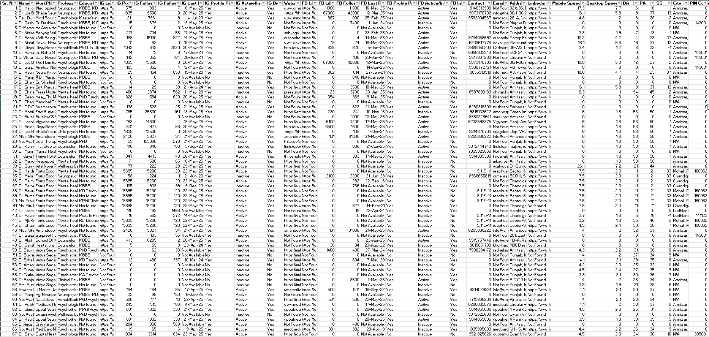
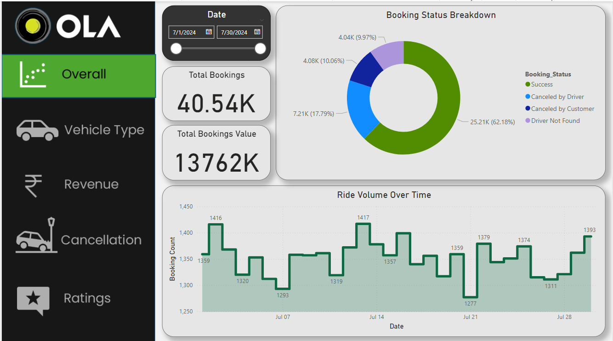
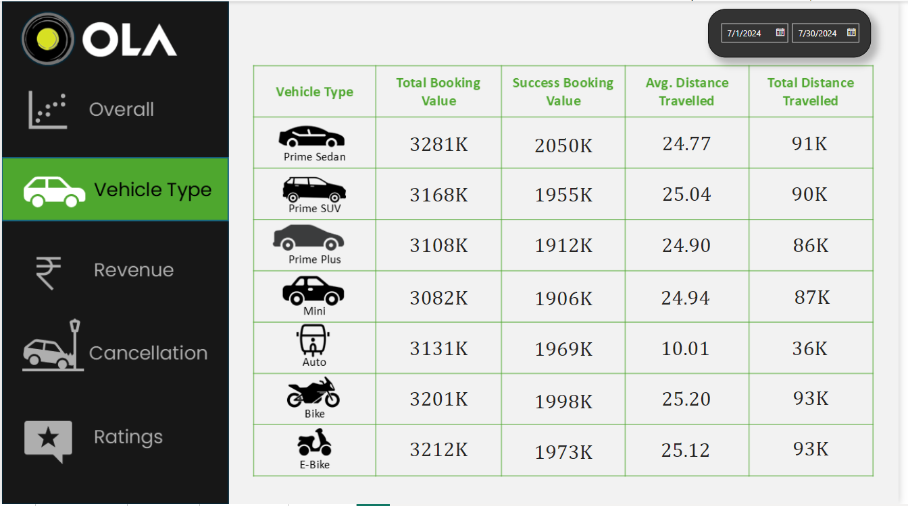
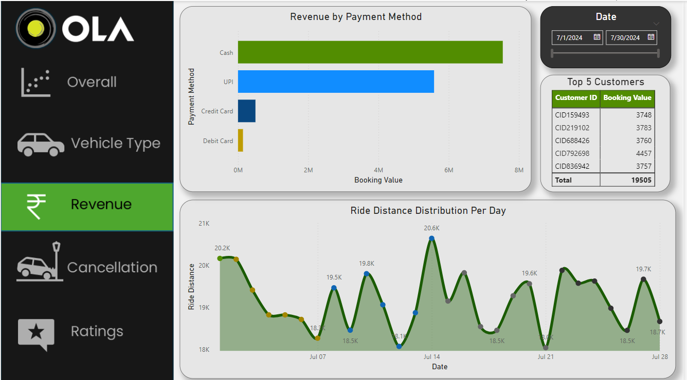
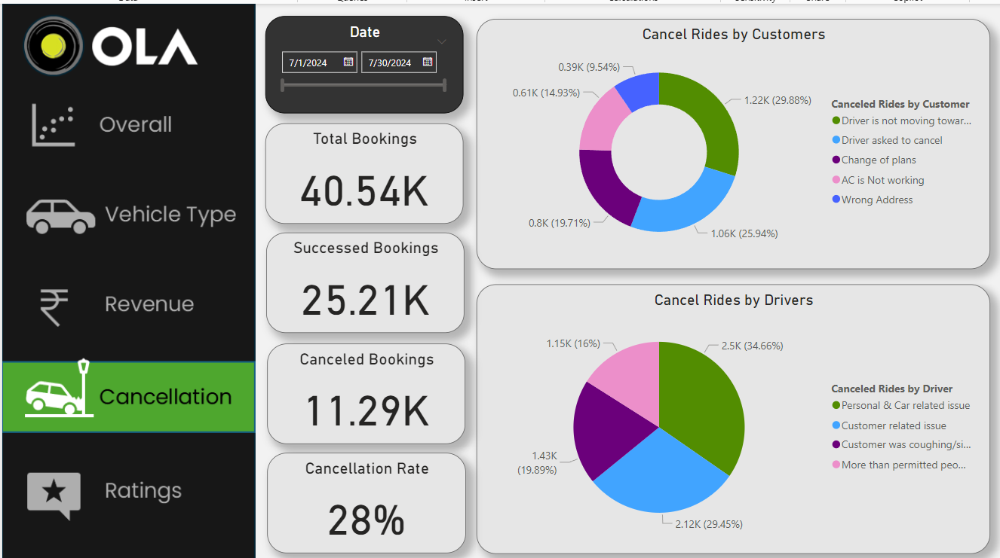
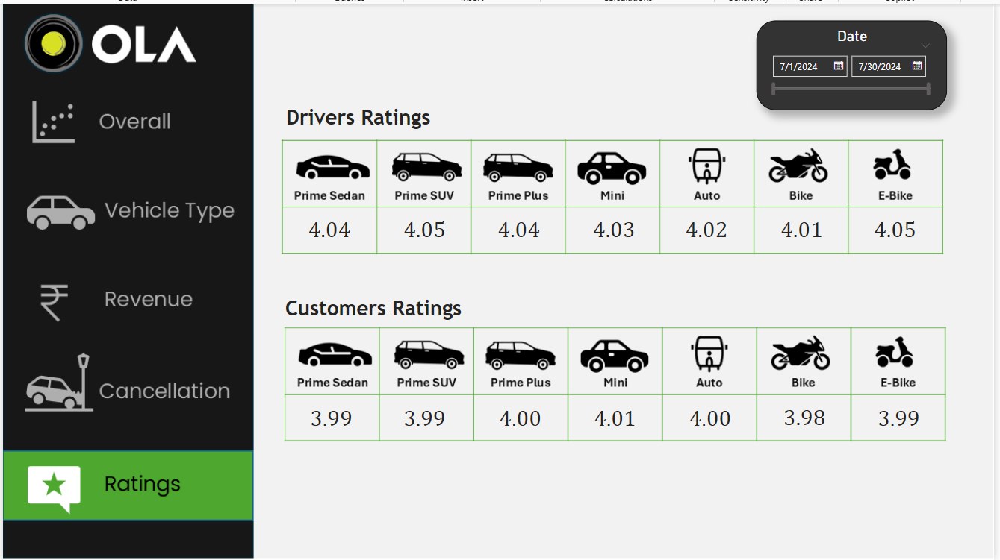

  

<h1 align="center" style="color:lightgrey; font-size:30px;">
  <b>Project Report</b>  
</h1>
<h2 align="center" style="color:lightgrey; font-size:20px;">
OLA Ride Bookings Data Analysis Project

</h2>

  Prepared by: Sahil Chaudhari  
(Data Analyst)

___________________________________________________________________________________________________________________________

##### Table of Contents
| Sr. No. | Section                      | Page No. |
|---------|------------------------------|----------|
| 1       | Abstract                     | 2        |
| 2       | Introduction                 | 2        |
| 3       | Objectives                   | 2        |
| 4       | Scope of work                | 2        |
| 5       | Data Collection              | 3        |
| 6       | Data Cleaning and Preparation| 3        |
| 7       | Dashboard Development        | 3-4      |
| 8       | Insights and Analysis        | 4-5      |
| 9       | Conclusion                   | 5        |
| 10      | Appendix                     | 5-8      |

___________________________________________________________________________________________________________________________

### Abstract
This project focuses on analysing large-scale Ola ride booking data to derive meaningful insights using Excel, SQL, and Power BI. The dataset, collected from public sources, consisted of over 40,000 rows and 19 refined columns. After performing data cleaning and transformation in Excel, the dataset was imported into SQL for analysis and further visualized in Power BI through five interactive dashboards. The project delivers key insights into customer behaviour, revenue trends, vehicle preference, cancellation patterns, and ratings, simulating a real-world data analyst workflow..

### Introduction
Ride-hailing services like Ola generate large amounts of transactional data every day. Analysing this data can help businesses understand customer trends, vehicle utilization, payment preferences, and service quality. This project takes a structured approach to extract, clean, analyse, and visualize Ola booking data to drive business intelligence and decision-making.

### Objectives
•	To clean and prepare raw booking data for structured analysis.
•	To use SQL for deriving key performance metrics.
•	To visualize the data through dynamic dashboards in Power BI.
•	To identify trends in booking volume, revenue, vehicle usage, and service quality.
•	To improve storytelling using data-driven insights.

### Scope of Work
•	Collection of raw data from public online sources.
•	Cleaning and preprocessing using Excel.
•	Importing structured data into SQL for querying and metrics computation.
•	Building five separate dashboards in Power BI.
•	Generating insights around bookings, revenue, cancellations, and ratings.
•	Delivering a comprehensive data analyst project that simulates industry practices.

### Data Collection
•	Source: Data related to Ola ride bookings was collected using Google from publicly available CSV-based sample data and case study materials.
•	Data Points Included:
•	Booking ID, Customer ID, Date/Time, Pickup/Drop Location
•	Vehicle Type, Distance, Payment Mode, Fare
•	Customer & Driver Rating, Booking Status, Cancellation Type
•	Raw Format Issues: Missing values, inconsistent formats, duplicate rows, and unnecessary columns.

### Data Cleaning and Preparation
•	Tool Used: Microsoft Excel
•	Steps Taken:
•	Removed duplicates and empty rows
•	Standardized datetime format and corrected typos
•	Cleaned special characters and extra spaces
•	Filtered out irrelevant or broken columns
•	Final Output:
•	Rows: ~40,000+ clean entries
•	Columns: 19 relevant fields retained
•	Exported the clean data to CSV format and imported it into SQL for analysis.

### Dashboard Development
After SQL-based exploration, the data was imported into Power BI. Using Power Query Editor, data types were adjusted and relationships defined. The following five dashboards were created:
•	Overall Bookings Dashboard
##### Visuals:
o	Pie Chart: Booking Status (Completed, Canceled)
o	Line Chart: Ride Volume Over Time
o	Cards: Total Bookings, Cancellation Rate, Completed Rides
•	Vehicle Type Analysis
##### Visuals:
o	Table: Total Booking Value & Average Value by Vehicle Type
•	Purpose: Highlight top-performing vehicle categories
•	Revenue Dashboard
##### Visuals:
o	Bar Chart: Revenue by Payment Mode
o	Area Chart: Ride Distance Distribution Per Day
o	Table: Top 5 High-Spending Customers
•	Cancellations Dashboard
##### Visuals:
o	Pie Charts: Cancellations by Customer & Driver
o	Cards: Total Bookings, Cancellations, Cancellation Rate
•	Ratings Dashboard
#####  Visuals:
o	Table: Average Customer Rating
o	Table: Average Driver Rating

### Insights and Analysis
•	Ride Volume Trends: Steady increase over time, with peak in evenings.
•	Vehicle Type: Prime Sedan and Mini had the highest booking and revenue share.
•	Revenue: Digital payment methods (UPI/Wallet) were more popular than cash.
•	Cancellations: Slightly more cancellations by customers than drivers.
•	Ratings:
o	Customer Avg Rating: 4.2
o	Driver Avg Rating: 4.0
•	Top 5 Customers: Contributed significantly to overall revenue.
•	Distance Trends: Moderate ride lengths were most common.

### Conclusion
This project successfully demonstrates an end-to-end analytics process using industry-standard tools. Starting from raw data collection, it covers cleaning, SQL querying, and dynamic dashboard development. The insights gathered help understand customer behaviour, operational bottlenecks, and revenue flow. It validates the importance of structured data analysis in business decision-making.

### Appendix
•	Dataset Screenshots

  

<i>Pic. Dataset 1</i>

•	Dashboard Screenshots

  

<i>Pic. Dashboard 1</i>

  

<i>Pic. Dashboard 2</i>

  

<i>Pic. Dashboard 3</i>

  

<i>Pic. Dashboard 4</i>

  

<i>Pic. Dashboard 5</i>

